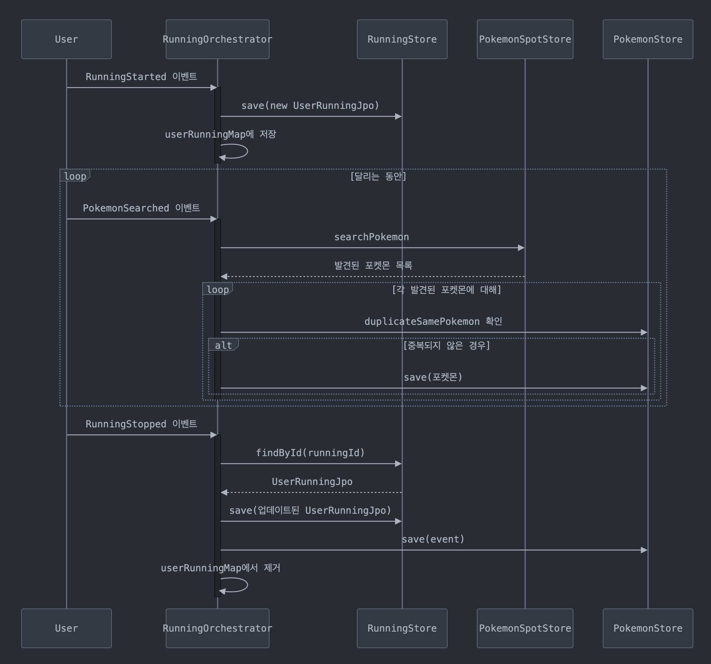

# 1. 포케러너 프로젝트

사용자에게 러닝 부여를 심어주기 위한 프로젝트.
첫 진입 화면에서 사용자에게 포켓몬을 선택하게 하고, 달린 거리에 따른 경험치 합산을 적용한다.

레벨이 3, 5에 도달할 때마다 진화를 한다.

## 최초 DB 설계

- users: 유저 정보 테이블
- user_pokemon: 유저가 가진 포켓몬 테이블
- pokemon: 포켓몬 정보 테이블
- user_running: 사용자가 달린 기록 테이블
- seoul_gu_boss: 서울 관장 테이블
- seoul_gu: 서울 구 리스트가 담긴 테이블

## 기능 정리

- 달리기의 경우 사용자 하나당 스레드를 하나씩 할당해 달리기를 시뮬레이션 한다.
- 특정 위치에서 달리기를 시작하고 랜덤 방향을 적용해 그 방향으로 달리기를 하도록 한다.
- 달리기를 하고 있을 때
    - 관리자가 특정 위치 좌표에 놓은 포켓몬 진화 1단계를 가져올 수 있도록 한다.
    - 반경 5km 내부에 달리기를 하는 사용자가 도착했을 때, 그 즉시 인벤토리에 그 포켓몬을 넣는다.
    - 이미 포획된 포켓몬은 다른 사용자가 가져가는 것은 불가능하다.
- 달리기를 종료했을 때 발생되어야 하는 이벤트는 다음과 같다.
    - 포켓몬 경험치가 오른다.
    - 평균 속도, 페이스, 달리기를 종료했을 때의 기록을 남긴다.
    - 포켓몬 레벨이 일정 레벨에 도달하면 진화한다.
- 구에 따른 랭킹을 매겨 구 관장을 할 수 있다.
    - 구를 클릭하면 랭킹 1-3등까지 점수를 매긴다.

## 상세 구현

### 유저 & 포켓몬 관리

- 사용자는 회원가입 시 기본 포켓몬을 선택한다.
- 사용자가 달리지 않으면 포켓몬 건강이 깎인다.
- 사용자가 달릴 때 포켓몬 경험치를 획득한다.
- 사용자는 홈 화면에서 레벨, 경험치, 유저의 디폴트 캐릭터, 닉네임, 캐릭터 이름, 얼마동안 안달렸는지를 확인할 수 있다.
- 사용자가 쌓은 경험치에 따라 해당 지역의 짱이 될 수 있다.

### 달리기

- 달리기 자체를 이벤트로 본다.
- 이벤트를 관리하는 `RunningOrchestrator` 클래스를 둔다.
- 달리기를 시작했을 때, 종료했을 때 이벤트를 발행한다.
- 이벤트가 발행되면 `RunningOrchestrator` 는 각 이벤트 타입을 보고 그에 맞는 이벤트를 처리한다.
    - `RunningStarted`
    - `RunningStopped`
    - `PokemonSearched`

## 프로젝트 실행

- 이 프로젝트의 실행에는 MySQL 8.0 이상의 버전이 필요합니다.
- pokerunner-ddl.sql 파일을 실행이 필요합니다.